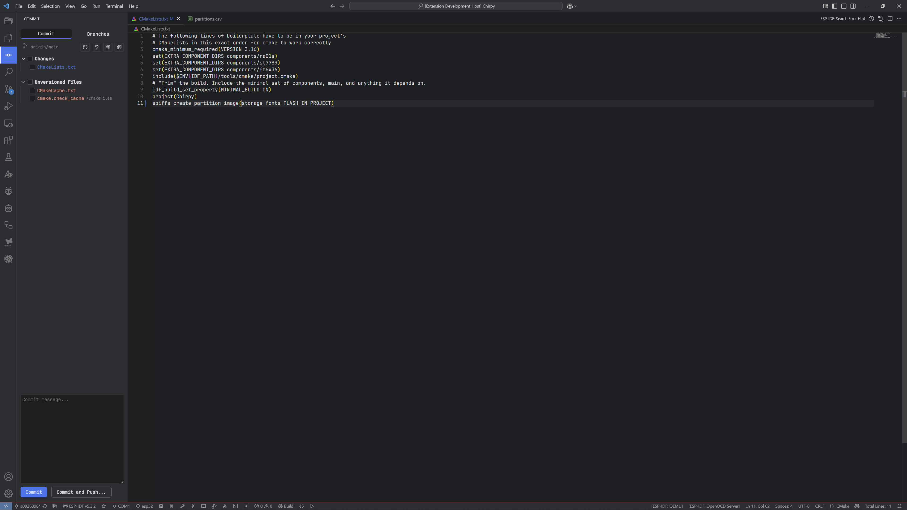
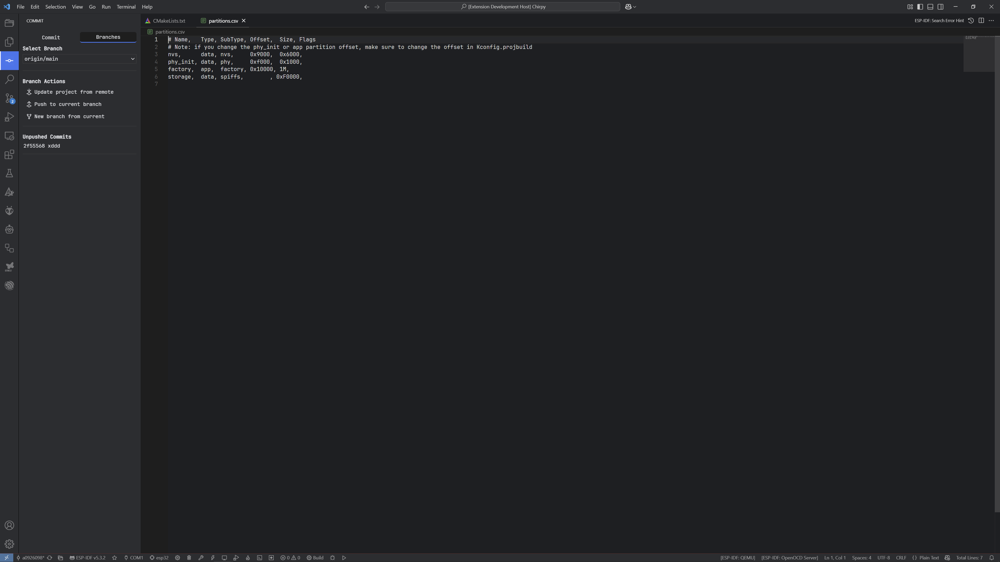

# Jetbrains Version Control

A faithful recreation ofJetBrains' commit side panel, made for Visual Studio Code.

THIS EXTENSION IS WORK IN PROGRESS! IF YOU HAVE ANY ISSUES/FEATURE REQUESTS PLEASE LET ME KNOW!
I created this because I liked the fast and convenient way to quickly check and commit individiual files in Jetbrains IDEs.
Best used with my Clion Dark Perfected theme!

---

## Preview




---

## Features

- Commit/Pushing
- Revert changed files
- See difference by double clicking a changed file
- Updating project from remote
- Creating new branches from current
- Switching & checking out branches
- Seeing unpushed local commits


---

## Installation

You can install this theme directly from the VS Code Marketplace

### Via Marketplace

1. Go to the Extensions view (`Ctrl+Shift+X`)
2. Search for **Jetbrains Version Control**
3. Click **Install**

### Or use the command line:

```bash
code --install-extension "the extension"
